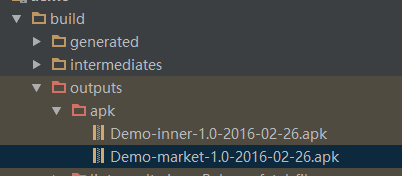

# 修改打包名称
## 1.定义App名和打包日期

```groovy
def appName = 'Demo'
def releaseTime = new Date().format('yyyy-MM-dd')
```

## 2.定义Flavor

```groovy
productFlavors {
     inner {
         //somthing
     }
     market {
         //somthing
     }
 }
```

## 3.输出包

```groovy
android.applicationVariants.all { variant ->
    variant.outputs.each { output ->
        def outputFile = output.outputFile
        if (outputFile != null && outputFile.name.endsWith('.apk')) {
            def fileName = "${appName}-${variant.flavorName}-${defaultConfig.versionName}-${releaseTime}.apk"
            output.outputFile = new File(outputFile.parent, fileName)
        }
    }
}
```

## 4.最终结果

